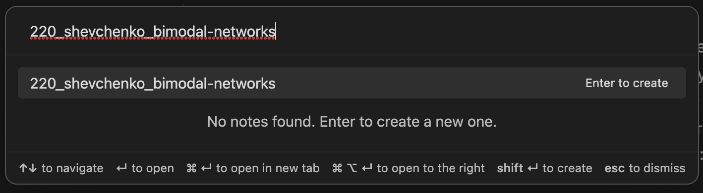

# ANR Lab Annual Report 2023

## Как начать работать с отчётом

### Открываем шаблон
1. Скачайте и установите [GitHub Desktop](https://desktop.github.com/), [Obsidian](https://obsidian.md) и [Zotero](https://zotero.org). Когда Zotero предложит установить Zotero Connector, согласитесь и установите — он понадобится позже.
2. Если у вас нет аккаунта на GitHub, [зарегистрируйтесь](https://github.com/signup).
3. Клонируйте этот репозиторий на свой компьютер с помощью GitHub Desktop — вот [инструкция](https://docs.github.com/ru/desktop/contributing-and-collaborating-using-github-desktop/adding-and-cloning-repositories/cloning-a-repository-from-github-to-github-desktop). А здесь — [вводное видео про Git, GitHub и как и зачем этим пользоваться](https://www.youtube.com/watch?v=8Dd7KRpKeaE).
4. В GitHub Desktop во вкладке меню **Repository** выберите "Open in Terminal" и вставьте туда эту команду `git update-index --assume-unchanged .obsidian/`
	- это позволит не загружать в GitHub файлы настроек Obsidian. Это значит, что вы сможете устанавливать нужные вам плагины, менять настройки программы, и это останется только на вашем компьютере.
5. Откройте Obsidian, выберите **"Open folder as a vault"**, а затем — папку на вашем компьютере, в которую вы сохранили этот репозиторий. Вы увидите что-то подобное:

6. Это текстовый редактор, в котором мы будем писать отчёт, используя язык Markdown. Здесь [короткая справка, как писать на Markdown](https://www.markdownguide.org/basic-syntax/) (там просто, правда).
7. Создайте новый файл, нажав `Ctrl+O` или `Cmd+O` на Маке. В открывшемся окне напишите название файла по формуле:
	 - **000_тема-текста_фамилия**, где 000 — порядковый номер вашего текста в отчёте:
	1. 000 зарезервировано для файла с метаданными отчёта
	2. Первая цифра — глава. Например, 0 — введение. Ей соответствует # в тексте.
	3. Вторая цифра — параграф, крупный пункт. Ему соответствует ## в тексте.
	4. Третья цифра — часть подзаголовка. Ей соответствует ### в тексте.
	Давайте для простоты называть всё по-русски. Например, я хочу создать файл, который будет частью введения:
	 

9. Почитайте шаблон и поэкспериментируйте с ним, пока не разберётесь, как им пользоваться.

### Настраиваем Zotero
1. Если на пользовались рефереренс-менеджерами, то посмотрите [введение](https://www.youtube.com/watch?v=JG7Uq_JFDzE).
2. Создайте в Zotero коллекцию «Отчёт» и экспортируйте её в папку `service` внутри папки с репозирторием отчёта. Как это сделать, детально рассказано [здесь](https://www.youtube.com/watch?v=D9ivU_IKO6M).

> Хотя в видео экспортируют всю библиотеку Zotero, вам **нужно экспортировать только коллекцию «Отчёт»**.

3. Найдите тестовые статьи и попробуйте вставить их в созданный ранее файл. Это делается с помощью клавиш `Ctrl + Shift + E` — выпадает содержимое папки «Отчёт», которую вы создали в Zotero.

### Отправляем написанный файл в GitHub
Когда вы закончили работу над текстом, нужно отправить ваш текст в GitHub — там из него и файлов коллег автоматически будет собираться отчёт. Как отправить файл:
1. Зайти в GitHub Desktop — там покажутся все изменения, которые вы сделали.
2. Нажать "Fetch"
3. Выбрать галками только файлы в папках `text` и `service` (если вы загрузили библиографию). Остальные не нажимать. В процессе пофиксим, чтобы так не делать.
4. Слева внизу в маленьком текстовом поле рядом с вашей аватаркой кратко написать суть ваших изменений, например, «добавил цели и задачи» или «написала про блокмоделинг в разделе методологии». Если хотите, можете написать подробнее в окошке ниже. Там же можно отмечать других участников.
5. Нажать кнопку "Commit"

## Домашнее задание (до 03.07.2023)
Проделайте все шаги в этой инструкции — сделайте и загрузите правильно названный файл с текстом и файл с библиографией в репозиторий. В текстовом файле используйте:
1. Несколько уровней заголовков (#)
2. Цитирование со скобками — [@a.haines2007] и без @a.haines2007.
3. Сноску[^1]
4. Картинку (обратите внимание, как отформатирована картинка в тестовом файле в репозитории)

К 3 июля все должны залить в этот репозиторий по одному текстовому файлу с любым текстом. Главное — потренироваться.

## Горячие клавиши
- `Ctrl + O` — открыть навигатор файлов, чтобы создать новый файл
- `Ctrl + S` — линтер, автоматическое форматирование
- `Ctrl + Shift + 8` — создать сноску
- `Ctrl + Shift + E` — вставить цитирование
Остальные можно посмотреть в настройках, во вкладке Hotkeys (нажать на иконку фильтра и выбрать Assigned).

[^1]: Вот сноска.
